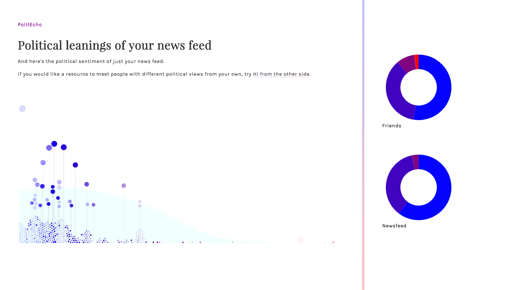

# PolitEcho 

As students of a small liberal arts college in New Jersey, we were completely convinced that Hillary Clinton would be our next president. So when Donald Trump crossed the 270 Electoral College points threshold, we asked ourselves, how were we so wrong? Our Facebook news feeds promised a Clinton landslide that failed to materialize. Thus we realized that our small liberal arts college in New Jersey friends do not represent America. According to John Oliver of *Last Week Tonight with John Oliver*, we're just sounding off on the internet or sharing think pieces or videos like this one, that echo around your bubble. So naturally we ask ourselves, do we actually live in a bubble on Facebook? And how strong is the echo? Thus emerged PolitEcho. 

## What is PolitEcho? 

PolitEcho is a Chrome extension that visualizes the political bias of your Facebook news feed and friends. This app uses your friends' likes and shares of stories from prominent news sources to characterize their political biases. By examining which of these friends have the largest presence on your own news feed, we are also able to determine and display the relative bias of your news feed posts.

Ultimately, we hope PolitEcho will make it easier for people to reflect on their own political biases and encourage people to make connections outside their immediate "bubble" of like-minded friends.

## Technical Description
### Data Collection
The primary data used by the app was page likes on Facebook. We developed methods of figuring out what pages a specific Facebook user has liked through careful analysis of the web page's source. Pages and users were tracked by their Graph ID. 

In a similar fashion, we recovered information on the sources of posts on the user's personal news feed. This information was then used to examine the relative bias of that user's news feed.

### Data Analysis
In general, we examined if users liked posts made by various news sources, like the New York Times or Fox News, on their Facebook pages. Each news source was manually assigned a corresponding position on the conservative-liberal scale of political ideology, and a user's rating was determined as an average of the news sources they interacted most with. By repeating the process for every person in the user's friends list, we built a picture of the relative political leanings of a person's social neighborhood.

The bias of the user's friends was then compared with the bias of the user's news feed. The top couple of posts were ranked based on the rankings of friends who liked or shared these posts. 

### Front-end
The primary language used for the front-end was Javascript. The entire application was put together within the Google Chrome Extension system to take advantage of its cross-site request capability. JQuery was used for most of the processing work and d3.js was used to help construct the visualization.

In a standard use case, a user who has logged into their Facebook account simply clicks on the PolitEcho chrome extension icon in their browser. This opens a separate page where the app fetches the required data from Facebook and displays the visualization.

The visualization shows political leaning on the x axis, with more liberal users/posts colored blue and placed closer to the left side of the visualization. Conservative users/posts are colored read and placed on the right side of the visualization. Each of the user's friends is given a point, resulting in a clear depiction of the relative distribution of political opinion within one's immediate friend group. 

The second screen of the visualization draws the political position of news feed posts relative to the political biases of the user's friends. The posts are raised, with the y axis depicting the frequency that friends liked that post. On the third screen, pie charts summarize the difference in distribution of political bias between your friend group and news feed.

## The Political Science Behind PolitEcho 

One of our team members is currently taking American Politics, of which an entire week was devoted to studying the concept of public opinion. In *The Nature and Origins of Mass Opinion*, political scientist John Zaller presents his famous RAS(Receive-Accept-Sample) model of public opinion. It was based on Four Axioms. 

> A1: Reception Axiom:
The greater a person's level of cognitive engagement with an issue, the more likely she or he is to be exposed to and comprehend (i.e. receive) political messages concerning that issue.
 
> A2: Resistance Axiom:
People tend to resist arguments that are inconsistent with their political predispositions, but they do so only to the extent that they possess the contextual information necessary to perceive a relationship between the message and their predispositions.
 
> A3: Accessibility Axiom:
The more recently a consideration has been called to mind or thought about, the less time it takes to retrieve that consideration or related considerations from memory and bring them to the top of the head for use.
 
> A4: Response Axiom:
Individuals answer survey questions by averaging across the considerations that are immediately salient or accessible to them.

Thus, the probability that the individual will give a liberal response is:  
Probability(liberal response) = Liberal messages available / (Liberal messages available + Conservative messages available) 

Zaller also assumes that the messages are from elite discourse rather than from personal interactions. This key distinction made our project possible but we can assume that an individual's public opinion is based on elite discourse, such as the media and politicians rather than their friends. Thus, we did not have to try to hack Facebook for process a user's personal political discourse over Messenger. Rather, we can assign an individual a liberal/conservative score based on their interaction with elite discourse: public pages they've liked on Facebook. 

We divided up elite discourse into three sections: reputable news sources, fake news sources, and politicians. Though Zaller's model says nothing about elite discourse that provides misleading information, we feel it is an important source to include due to the controversial role fake news is claimed to have played in the most recent presidential election. We gathered a database of the Facebook pages of reputable news sources, fake news sources, and politicians and assigned them weights then used that to assign a score to each user, lower scores being more liberal and higher scores being more conservative. 

Zaller's RAS model is meant to be applied on an individual basis but PoltiEcho is able to classify hundreds of people at once, allowing us better under how the media and social media affect public opinion and potentially even the outcome of an election. When used within a friend group, our visual graph will literally show you the bubble you live in on Facebook. 

###Sources: 
- Zaller, John. *The Nature and Origins of Mass Opinion.* Cambridge: Cambridge UP, 1992. Print.
- https://www.washingtonpost.com/news/the-fix/wp/2014/10/21/lets-rank-the-media-from-liberal-to-conservative-based-on-their-audiences/
- http://graphics.wsj.com/blue-feed-red-feed/#/trump
- http://www.dailydot.com/layer8/fake-news-sites-list-facebook/
